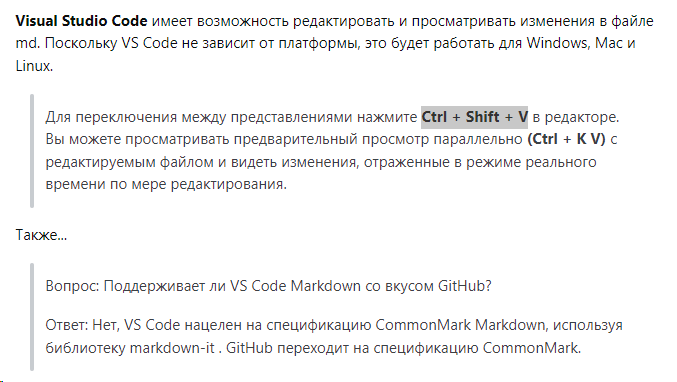
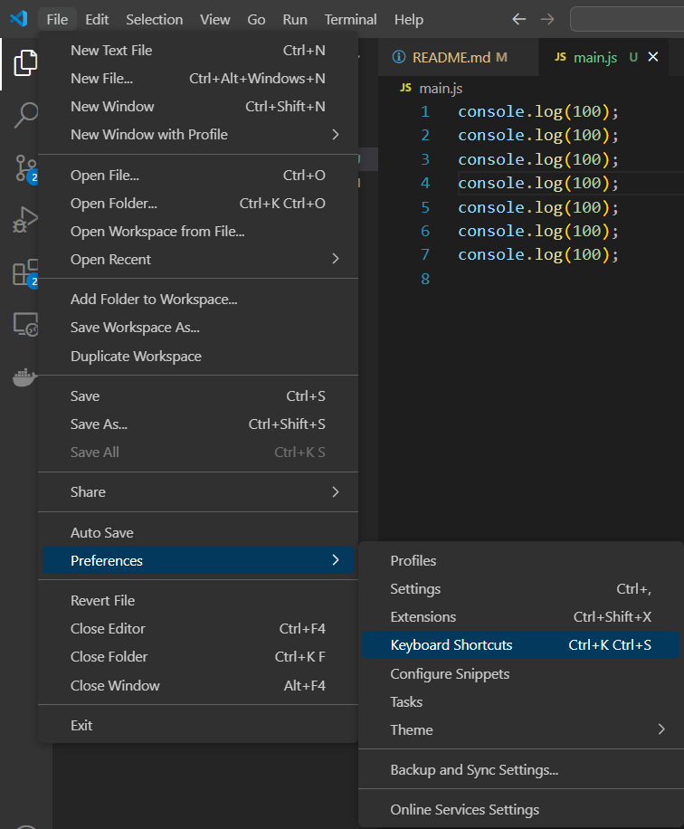
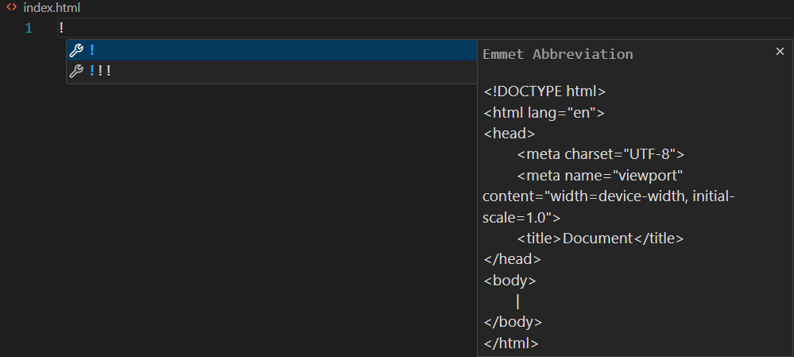
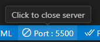
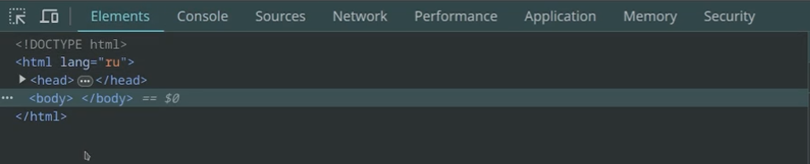
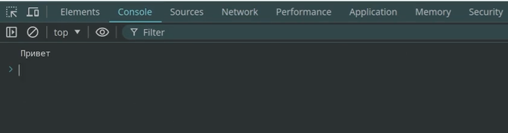
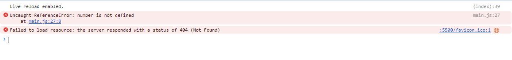

# studyJavaScript

Моя записная книга по курсу "Твой JavaScript" 

## Intro:
### 1.4

Настройка VSCode:
- Ctrl + Shift + P - settings in VSCode.

### 1.5 - Подготовка к работе в VSCode

Снипеты - помощники при написании кода.

- Ctrl + Shift + V - переключение между представлениями (это чисто для MarkDown).



- Ctrl + Shift + L - выделение всех похожих символов и в дальнейшем можно их заменить.

### 1.6 - Установка NodeJS

NVM (Node Version Manager) - менеджер версий NodeJS.
https://github.com/nvm-sh/nvm (под Linux) - скрипт для быстрой смены версий NodeJS. Но для винды такое не пройдет, для винды у нас - https://github.com/coreybutler/nvm-windows. (по сути это больше для комфорта смены версий NodeJS).

### 1.7 - Первая программа

- Запуск приложения - **node [имя_файла]**

- Hotkeys:
https://stackoverflow.com/questions/70120201/ctrld-is-not-working-in-vs-code-copy-similar-code



- Помошник с готовыми сниппетами (Emmet Abbreviation)



> ```<!DOCTYPE html>``` - <u>указание типа документа</u>

> ```<html lang="en">``` - <u>главный тег (lang="en" - атрибут языка)</u>

> ```<head>``` - <u>служебный тег (для подключения стилей и т.д.)</u>

> ```    <meta charset="UTF-8">``` - <u>Кодировка страниц</u>

> ```    <meta name="viewport" content="width=device-width, initial-scale=1.0">``` - <u>Сообщает браузеру как работать с нашей страницей в плане масштаба</u>

> ```    <title>Document</title>``` - <u>То что пишется на вкладке страницы</u>


> ```</head>```

> ```<body>``` - <u>Все что видно на сайте</u>
    
> ```</body>```

> ```</html>```

- Кодировка [2:43 - 17 1.7 урока]

Главное также сохранять страницу в той же кодировке (UTF-8):


### 1.8 - Открываем сайт с JavaScript

- Live server



- Подключение JavaScript

```html
index.html
<body>
    <script>
        alert("Hello!")
    </script>
</body>
```

```js
main.js
alert("Hello!")
```

```html
<script src="main.js"></script>
```
src - Путь до нашего файла.

2-ой вариант лучше не только из-за порядка, но и в некоторых случаях кещируются данные в браузере и меньшая настройка на сеть.

Все данные должны быть отдельно (отдельно CSS, отдельно HTML, отдельно файлы с данными и т.д.).

### 1.9 - Атрибуты asunc и defer

По сути нам надо сначала чтобы прогрузились все теги на нашем "сайте", а потом уже подключились скрипты, поэтому мы ставил скрипты в теге **body**. Все выполняется последовательно сверху вниз, происходит парсинг сайта на теги.

Так вот есть 2 варианта подключения скриптов:
- А именно в конце **body**
- И в **head**, но только с использованием атрибута defer, то есть отложенная загрузка (Он начнет подгружать скрипт, но ждать его уже не будет, и когда уже все теги будут разобраны, будет запущен по идее скрипты, которые были с атрибутом defer, но тоже они выполняются по порядку). А есть еще атрибут async, его время и место выполнения не совсем понятны (крайне редко используется) - используется например для метрики.

### 1.10 - Инструкции в коде.

- Вкладка Elements - все из чего состоит наш сайт

- Вкладка Console

- Вкладка Sources - что что мы подгружали.
- Вкладка Network - все соединеня при открытии страницы.

Комментарий:
- Ctrl + / - // (можно даже для нескольких строк)
## Переменные 

### 2.1 - Создание переменных

- let => создать переменную 
- undefined - уникальное значение, это отдельный тип данных (ничего нет там).

### 2.2 - Константы (const) и устаревшее var

- const => в эту переменную мы не можем изменить на какое-либо другое значение.

### 2.3 - Правила именования

- В переменных нельзя использовать спец символы (кроме $ и _).
- Первым символом не может быть цифра.
- Не можем называть специальными именами (типо const const = 0;).

Стили названий:

```js
const username = "John"; // flat case - лучше не использовать для длинных названий
const userName = "John"; // camel case - main
const user_name = "John"; // snake case
const UserName = "John"; // Pascal case - для конструкторов и классов
```

На будущее, но скорее всего сменишь этот шорткат - Ctrl + K + C (Ctrl + /) (закомментировать) or Ctrl + K + U (раскомментировать) - сменил shortcut Block Comment на Ctrl + Shift + /.

### 2.4 - Строгий режим - use strict

Можно просто написать: 

```js
number = 5;
console.log(number);
```

НО - так лучше не делать. Если объявляешь переменную - то нужно писать let или const.

И чтобы недопускать таких ошибок, мы можем использовать диррективу (`"use strict"`).
Автор рекомендует всегда писать ее в самом начале.

А вот какие у нас ошибки выводит `use strict` при запуске кода:



### 2.5 - Стиль кода

Вода чистой воды XD

### 2.6 - Отладка кода

Дебажиться мы можем во вкладке Sources в браузере.

А также мы можем прямо в файле js установить `debugger` и при запуске сайта, он упадет в месте, где установлен `debugger` (без брейкпоинтов).

```js
debugger;
```

### 3.1 - Обзор типов данных

Примитивные типы данных:

- number - число
- string - строка
- bolean -  булево значение
- bigInt - большое целое число (312312312312312312341243124n)
- symbol - символ
- undefined (мы ничего не определили, * создали переменную, но ничего не положили)
- null (значение отсутствует)

все эти значения типов являются immutable.

Составной тип данных:

- object (хранит внутри себя несколько типов) 

### 3.2 - Оператор typeof

typeof - определяет какой тип данных лежит в переменной

Но у него есть приколы, а именно:

- с null выдает object тип 
- с function выдает function, хотя такого типа нет.

### 3.2 - Number - числовой тип данных

IEEE 754 - формат того как хранятся числа

```js
const million1 = 1e6;
const million2 = 1_000_000; // same num
console.log(million1);
// шеснацетирич 0123456789ABC....
console.log(0xaf74cd);
// двоичная система
console.log(0b101010101);
// восьмиричная система
console.log(0o257); // до 7 включительно
// дробное число 
console.log(5.5);
// еще есть 2 нуля
console.log(0);
console.log(-0); // одинаково воспринимается
```

### 3.4 - Infinity, NaN и превращение числа в строку

- Number.isFinite - Это конечное число?

Код урока со всеми пометками по ходу:

``` js 
"use strict";

console.log(1e1000); // in console: Infinity (бесконечность)
console.log(50 / 0); // Infinity (бесконечность) (и да, тут можно делить на ноль)
console.log(50 / -0); // -Infinity (бесконечность)

const num1 = 60 / 0;
const num2 = 60 / 1;
console.log(Number.isFinite(num2)); // "Number.isFinite - Это конечное число?"

const num3 = 50 / "yes";
console.log(num3); // NaN
console.log(typeof num3); // type number
console.log(Number.isNaN(num3)); // true

// А также можно использовать без Number, но лучше использовать с ним, так как там многое исправлено.

const num4 = 52;
console.log(typeof num4);
console.log(typeof num4.toString()); // преобразование в строку, а также можно преобразовать:
console.log(typeof (num4 + "")); // когда мы плюсуем, то JS смотрит какие типы данных складывается, то он переводит 52 в строку и плюсует, но лучше через ToString().
// а также можно в различных системах исчисления:
console.log(num4.toString(2)); // в двоичной
console.log(num4.toString(8)); // в восьмиричной 
console.log(num4.toString(16)); // в шестнадцатиричной
```

### 3.5 - Превращение строки в число

2 вида преобразования:

``` js
const num2 = "52";

console.log(+num2); 
console.log(Number(num2)); 
```

Правила превращения:

- пробельный символы будут игнорироваться, как будто их и нет, но только пробелы в начале и конце:

``` js
const num2 = "    52    ";
```
Если же поставить пробелы в середине, то это уже будет NaN (потому что он не сможет превратить все это значение в число):

``` js 
const num2 = "    5 2    ";
```

- Также можно поставить + и -:
``` js 
const num2 = "    +52    ";
```

``` js 
const num2 = "    -52    ";
```

- можно также записывать так (но без минусов): 

``` js 
const num2 = "    0xFA4    ";
```

- также нужно использовать только числа, то не числовое, он воспринимать не будет:

``` js 
const num2 = "    23rub    "; // NaN
```

- если строка будет вообще пустой, то выйдет 0:

``` js 
const num2 = "    "; // 0
```

`Number.parseInt` - превращает в целое число (23.55 - отбросит дробную часть).
`Number.parseFloat` - превращает в дробное число (23.55 - сохранит дробную часть)

Они оба идут слева направо по строке, собирают что подходит и смотрят что им не подходит, стопаются.

Например: 

``` js 
const num2 = "   23.2qwe3   ";

console.log(+num2) // NaN
console.log(Number.parseInt(num2)) // 23
console.log(Number.parseFloat(num2)) // 23.2
```

Еще пример, но уже практический: 

``` js 
const str = "23px"; // получили 23 пикселя

console.log(+num2) // NaN
console.log(Number.parseInt(num2)) // 23
console.log(Number.parseFloat(num2)) // 23
```

Выбор за вами!

``` js
const num = Number.parseInt("10 или 20", 20);
console.log(num);
```

### 3.6 Неточность вычислений

### 3.7 Округление чисел

```js
console.log(Math.round(24.7)); // округляет до целой части (как в математике)
console.log(Math.floor(24.7)); // округляет в меньшую сторону
console.log(Math.ceil(24.7)); // округляет в большую сторону
console.log(Math.trunc(24.7)); // отрубает дробную часть
```

- как оставить 2 знака после запятой (бред конечно огромный):

```js
const num = 24.3456;

// по этапам
console.log(num);
console.log(num * 100);
console.log(Math.trunc(num * 100));
console.log(Math.trunc(num * 100) / 100);
// Итог:
console.log(Math.trunc(num * 100) / 100);
```

- Но есть готовый вариант, хотя с ним нужно быть поаккуратнее:

```js
console.log(num.toFixed(2)); // но тут возвращает строку и округляет как в математике
```

### 3.8 Минимальное, максимальное и случайное значения

```js
console.log(Math.min(2, 5, -4, 1)); // min
console.log(Math.random()); // случайное число, от 0 до 1
console.log(Math.trunc(Math.random()* 10)); // случайное число, от 0 до 10
```

- Вопрос:

Решил, подглядев, но так и не понял, почему с '+ min' не включается верхнее значение.

- Ответ:

```
+ min только сдвигает значения. Давай по порядку:

Math.random() - дает число от 0 до 1 (где 1 никогда не выпадет), то есть диапазон [0, 1).
Math.random() * 10 - дает число от 0 до 10 (где 10 никогда не выпадет), то есть диапазон [0, 10).
Math.trunc(Math.random() * 10) - дает целое число от 0 до 10 (где 10 никогда не выпадет), то есть диапазон [0, 10).
Math.trunc(Math.random() * (10 - 5)) - добавляем одну часть min, дает целое число от 0 до 5 (где 5 никогда не выпадет), то есть диапазон [0, 5).
Math.trunc(Math.random() * (10 - 5)) + 5 - добавили последнюю часть min, дает целое число от 5 до 10 (где 10 никогда не выпадет), то есть диапазон [5, 10). Этот min просто сдвигает значение в нужную сторону оба значения, как минимальное, так и максимальное в диапазоне, не более того.

Таким образом, нигде не включается значение правое (максимальное), ни в одном из вариантов.

Отпишись, если что-то непонятно. Лучше в телеграм, там проще решить эти вопросы :)

П.С. Как закончим здесь общение, удалю этот комментарий, т.к. тут ответ на задание практически.
```

### 3.9 String - строки

- Все строки используются в UTF-16 формате.
- Создание строки:

```js
const str1 = 'HI';
const str2 = "HI";
```

- есть backtick - ``
- Подстановка строки в строку:

```js
const count = 5;
console.log("I have" + count + "apples");
// но можно использовать косые кавычки:
console.log(`I have ${count} apples`);
```

- можно переносить строку (но это работает только с косыми кавычками):

```js
const str = `
HI.
Bye.
`;
console.log(str);
```

### 3.10 Углубление в строки

- Длина строки (str.lenght)
- Обращение к элементу строке:

```js
console.log(str[0]);
console.log(str.at(0)); // одинаковые выражения по сути.
```

- Обращение к последнему элементу:

```js
console.log(str[str.lenght - 1]);
console.log(str.at(-1)); // одинаковые выражения по сути.
```

`При получении несуществующего элемента (допустим сиволов 10, а мы берем 50 элемент), мы получим undefined.`

- Строки не изменяемые, то есть мы не можем менять элементы в строке (но добавлять мы можем).

### 3.11 BigInt - большие целые числа

Если число больше `Number.MAX_SAFE_INTEGER` и меньше `Number.MIN_SAFE_INTEGER` - то обычный number нам не пойдет.

- n в конце большого числа означает что это BigInt.

```js
const BigNum = 47823648263423423423n;
```

- Действия с данным числом мы можем делать только с числами с типом BigInt.

_JS динамически типизированный и слабо типизированный язык, то есть он автоматом переводит тип, но не с BigInt._

- Автомамтом в строку не переводится.

### 3.12 Boolean

Код урока:
```js
"use strict";

const greaterThen = 5 < 3;
console.log(greaterThen);

console.log(5, Boolean(5)); // true
console.log(0, Boolean(0)); // false
console.log(null, Boolean(null)); // false
console.log(undefined, Boolean(undefined)); // false
console.log(NaN, Boolean(NaN)); // false
console.log(50n, Boolean(50n)); // true
console.log(0n, Boolean(0n)); // false
console.log("False", Boolean("False")); // true
console.log("", Boolean("")); // false
```

### 3.13 Symbol

- Используется для создания уникальных значений (идентификаторов возможно).

```js
const syn1 = Symbol("1");
```
Создали символ, с описанием 1. 
- Так как символы уникальны, то: 

```js
const syn1 = Symbol("1");
const syn2 = Symbol("1");
console.log(syn1 == syn2); // false
```

- Воссоздать один и тот же символ невозможно.
- Символы используются в основном с объектами.

### 3.14 null & undefined


### 3.15 object

Код урока:
```js
"use strict";

const user = {
    firstName: "Eddy",
    age: 26,
    surName: "Nuss"
};

console.log(user);
```

### 3.16 Autoboxing

Свойста null и undefined:
- Методов у них (null и undefined) нет.

### 4.1 Операторы и операнды

- Операторы - действие, а операнды - то с чем происходит действие.

- Операторы:
= 
typeof (Унарный - 1 операнд)
МИНУС(-) (бинарный - 2 операнда)

*И есть еще тернарный, то есть у которого есть 3 операнда*

### 4.3 Конкатенация

- Конкатенация (склеивание), например - склеивание 2 - х строк (`console.log("fgdf" + "fsdfs");`).
- `console.log("fsdfs" + 5);` - (автоприведение типов).

Код урока:

```js
"use strict";

/* console.log("fgdf" + "fsdfs");
console.log(5 + "fsdfs");
console.log("fsdfs" + 5); // same shit (автоприведение типов) */

/* const mun1 = prompt("Enter number:"); // промт всегда взвращает нам строку.
// не забывай про разницу между ` и '!!!
console.log(`Если к числу ${mun1} прибавить число 5, то получим число ${mun1 + 5}`); // 105
console.log(`Если к числу ${mun1} прибавить число 5, то получим число ${Number(mun1) + 5}`); // 15 */
// либо можно использовать унарный +:
const mun2 = +prompt("Enter number:"); // преобразует в число
console.log(`Если к числу ${mun2} прибавить число 5, то получим число ${mun2 + 5}`); // 15
console.log(`Если к числу ${mun2} прибавить число 5, то получим число ${Number(mun2) + 5}`); // 15

// но с другими операторами по типу *, / и другими все будет выполняться как с числами (превращает в число).
```

### 4.4 Присваивание - =

### 4.5 Инкремент, декремент и запятая

Код урока:

```js
"use strict";

//num1--; // постдекрементная форма
//num1++; // постинкрементная форма
// разница ++num и --num от num++ num--:
// разница в возвращаемых значениях:
let num1 = 5;
const prefix = ++num1; // postfix - 6; num2 - 6
console.log("Num1", num1);
console.log("Prefix", prefix);

let num2 = 5;
const postfix = num2++; // postfix - 5; num2 - 6
console.log("Num2", num2);
console.log("Postfix", postfix);

// Запятая
//let a = 5, b = 10;
```

### 4.6 Сравнение