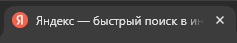
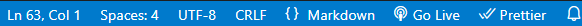

# studyJavaScript

Моя записная книга по курсу "Твой JavaScript" 

Intro:
### 1.4

Настройка VSCode:
- Ctrl + Shift + P - settings in VSCode.

### 1.5 - Подготовка к работе в VSCode

Снипеты - помощники при написании кода.

- Ctrl + Shift + V - переключение между представлениями (это чисто для MarkDown).


- Ctrl + Shift + L - выделение всех похожих символов и в дальнейшем можно их заменить.

### 1.6 - Установка NodeJS

NVM (Node Version Manager) - менеджер версий NodeJS.
https://github.com/nvm-sh/nvm (под Linux) - скрипт для быстрой смены версий NodeJS. Но для винды такое не пройдет, для винды у нас - https://github.com/coreybutler/nvm-windows. (по сути это больше для комфорта смены версий NodeJS).

### 1.7 - Первая программа

- Запуск приложения - **node [имя_файла]**

- Hotkeys:
https://stackoverflow.com/questions/70120201/ctrld-is-not-working-in-vs-code-copy-similar-code


- Помошник с готовыми сниппетами (Emmet Abbreviation)


> ```<!DOCTYPE html>``` - <u>указание типа документа</u>

> ```<html lang="en">``` - <u>главный тег (lang="en" - атрибут языка)</u>

> ```<head>``` - <u>служебный тег (для подключения стилей и т.д.)</u>

> ```    <meta charset="UTF-8">``` - <u>Кодировка страниц</u>

> ```    <meta name="viewport" content="width=device-width, initial-scale=1.0">``` - <u>Сообщает браузеру как работать с нашей страницей в плане масштаба</u>

> ```    <title>Document</title>``` - <u>То что пишется на вкладке страницы</u>


> ```</head>```

> ```<body>``` - <u>Все что видно на сайте</u>
    
> ```</body>```

> ```</html>```

- Кодировка [2:43 - 17 1.7 урока]

Главное также сохранять страницу в той же кодировке (UTF-8):

